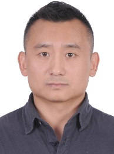

## 关于我
  *爱开源、爱游泳、爱网球的老男孩*

**黄先生**  **已婚**  **75后**  **户口：北京**  **现居住于北京**

**手机**：13520039732              **邮箱**：13520039732@139.com

Github：[https://github.com/bighenry1024](https://github.com/bighenry1024)

Blog：[http://www.jianshu.com/u/ebd9d51df86d](http://www.jianshu.com/u/ebd9d51df86d)

### 培训授课实录视频

- **mysql主主复制+高可用（健康检查）** [https://pan.baidu.com/s/1c2iS3lu](https://pan.baidu.com/s/1c2iS3lu)

- **Telnet讲解及tcpdump抓包分析三次握手、明文密码** [https://pan.baidu.com/s/1eSLyeVC](https://pan.baidu.com/s/1eSLyeVC)

- **Keepalived+LVS集群** [https://pan.baidu.com/s/1boQD7KN](https://pan.baidu.com/s/1boQD7KN)

### 工作意向
期望工作性质：	**全职**	期望工作地区： **北京(可短期出差)**

期望从事职业：	**运维总监**  **运维经理**  **云计算培训师-Openstack生态圈/Docker生态圈/虚拟化/公有云/运维自动化方向**

期望月薪： **45000元/月**

目前状况： **离职，考虑更高层次平台，到岗时间半个月**

### 自我评价

- 10+年IT运维和云计算领域工作经验，近期专注于Docker生态圈如k8s调度编排和推动DevOps实践；

- 另有近2年的培训讲师及项目经理工作经验，对线下、在线教育培训行业现状有较深理解，有一定人脉；

- 熟悉实时互动音视频直播平台架构、业务及应用场景；

- 熟悉阿里云、腾讯云、犀思云主流云产品如云主机、海内外专线、SLB、高防等，熟悉网宿、首都在线、鹏博士、世纪互联、Aryaka、Akamai等CDN厂商产品及特性，特别是视频加速、应用动态加速方面；

- 5+年10人以下IT部门管理经历，有一定的中层管理经验；

- 热爱开源乐于分享，热衷新技术尝鲜、研究攻关及应用落地；

- 具备自我管控、自我激励、自我提升能力，遵循DRY原则；

### 工作经历

**2017.04 - 08 北京三芒世纪科技有限公司** `运维经理` **汇报对象：**`总裁（创始人）`

- 负责规模业务应用24X7运维，持续进行监控、优化，主导解决运维重大故障、直播大并发保障等问题；

- 分析系统瓶颈，评估存储、基础设施、带宽及CDN质量，完成扩降容、海内外链路优化等工作；

- 重度参与基线及定制云教室产品技术方案和架构设计、前后端功能研发、性能优化、风险评估等；

- 带领运维团队从０到１自研CMDB，集成nagios监控、一键发布回滚、CDN带宽调整、弹性伸缩等功能，提升应用运维自动化程度；

- 负责运维团队日常管理，以DevOps理念优化研发、测试、运维工作流程；

**2016.05 - 2017.04 北京八维研修学院网络工程学院** `云架构项目经理` **汇报对象：** `学院院长`

- 独立负责毕业实训阶段（每班15人左右）为期两月、以IT企业运维团队管理方式进行全程项目实战，拓宽知识面广度及深度，通过真机实操强化学员专业技能、职场素养等，以胜任初级至中级云计算/云架构/云运维工程师职位；

- 指导所带毕业班100%对口高薪就业，并负责毕业后一年内定期跟踪、专业指导、维护等工作；

- 负责研发并完成各月项目实训课程大纲教学内容，确保其紧跟行业前沿发展方向及主流技术应用，确保持续更新、扩充。目前聚焦于：

- 负责监督制订专业阶段课程大纲、教学内容、技能考核题库，依据行业和技术发展趋势提供合理更新建议等；

**2015/09月-2016/04  北京八维研修学院网络工程学院**  `资深Linux讲师` **汇报对象：**`阶段主任`

- 负责多门Linux专业课的教学、运维实操、考核、班级管控，每班15人左右，课程包括：
	《Linux系统管理》、《Linux应用服务及运维》、《SQL及NoSQL数据库基础》、《集群架构》、《Shell脚本实战》;

- 负责上述课程大纲研发完善、教案、微视频等相关材料，及教学方法持续改进；

- 对教学质量负责，保证学员满意度；

**2009/01 - 2015/08 赛迪顾问股份有限公司**  `信息技术经理/主管` **汇报对象：** `运营总监`

- 2010年，与部门经理共同带领内容采编、技术、美工团队研发部署全新的公司业务网站赛迪顾问在线(www.ccidconsulting.com)，持续把握IT技术方向，提升公司在线咨询业务技术含量及部门经营业绩，协助公司进行市场推广及品牌宣传；

- 根据公司经营战略及发展规划，对公司信息化总体进程提供建议，明确业务部门需求，把握软件开发部门OA系统研发方向与进度，核心技术、二次开发产品选型、服务器、网络、存储设备、办公设备选型采购等工作；

- 全程参与公司通过ISO9001标准认证，是咨询业内率先通过该认证的企业；

- 参与集团总部及下属单位信息化相关工作。

**2001/12 - 2008/12 北京赛迪数据有限公司 系统工程师**

- 02-05年期间，系统管理员，与另2人共同负责原电子工业部一套全国电子产品管理及统计分析数据库系统（数十万条记录）的Solaris2.4小型机系统管理/ORACLE8i数据库DBA/专用数据上报软件开发维护，以及[中国电子行业信息网](http://www.ceic.gov.cn)（www.ceic.gov.cn，于07年末停运）日常系统运维，该网后台采编发系统（JAVA开发）管理及程序更新；
- 06年后任系统支持部主管，负责部门日常管理，该部门承担原中国电子行业信息网/原电子百强数据直报系统/赛迪数据网等多个网站系统运维工作，完成所有操作系统迁移至Redhat LINUX下，及相应的应用系统改造工作。此外，部门另一项重要工作是协助软件开发部研发基于数据挖掘的企业竞争情报系统（CIS）的本地化、数据库搭建、系统部署及调优、运维工作;

- 该公司于08年末并入赛迪顾问。

**2000/07 - 2001/10 新加坡Novasprint公司 程序猿**

- 基于用户需求，PowerBuilder/ASP/Coldfusion 开发医院医疗信息管理系统产品的部分业务模块，现场部署，解答用户疑问及系统维护 

### 近期项目
#### 2017.04-08 直播教育平台

**项目描述**

公司先后与乐视云、腾讯云签订深度合作协议，借助其公有云及销售渠道推广自有直播平台产品。作为乙方项目负责人与甲方对接，负责直播平台的基础设施选型、系统落地、日常运营，定期向公司总裁汇报；
同期带领运维团队实施一起作业、云南开放大学校园网、深圳易课等客户的云教室平台独立部署及运维相关技术支持；

#### **2016/05-至今 云计算专业学员高薪就业**

**项目描述**

学员进入就业实训阶段（每班15人左右），完成为期三个月、以IT企业运维团队管理方式进行全程项目实战，使学员具有DevOps理念，扩展学员行业、专业知识面广度及深度，通过真机实操强化学员专业技能、职场素养等，以胜任初级至中级云计算/云架构/云运维工程师职位要求，保证全部学员对口就业

**责任描述**

- 独立负责三届就业实训班，所带学员最高薪资为`试用15k转正18k ，最高班平均薪资10k`，项目聚焦于：
	1. Openstack私有云架构、部署、运维，Python二次开发有所涉及；

	2. 虚拟化技术入门（KVM原理及应用、VMware虚拟化产品）；

	3. 围绕Docker的相关技术（Dockerfile/compose/swarm、etcd、flannel、Consul等），应用迁移，容器调度编排等；

	4. 云存储技术包括Ceph分布式存储、Swift对象存储；

	5. 持续集成/持续交付架构（Jekins+GitLab容器实现）
    
	6. 传统运维包括：监控运维、应用运维、自动化运维、数据库、Shell脚本等；

- 结合每位学员各自特点、优缺陷，做针对性培训指导，保证学员全部按期顺利对口就业；

#### **2016/11 -- 至今：企业Openstack私有云规划、部署实施及私有云盘存储**

**软件环境**：Centos7/Ubuntu+Openstack N版（Keystone/Glance/Cinder/Swift/Neutron/Nova/Dashboard等组件）+Seafile云存储

**硬件环境**：IBM X3650M410余台+交换机、路由器若干

**开发工具**： Python/Shell脚本

**责任描述**

带领若干学员规划、设计及部署私有Openstack平台落地，在此Iaas上搭建私有云盘为学院教职工及上千学员进行海量文件共享交流，并保证关键数据文件安全；

**项目描述**：

Openstack具体规划如下：
包括三类节点，一台主控节点上部署Glance、Keystone、Cinder、Nova、Neutron、Swift proxy、Dashboard组件，虚拟网络配置L2 plugin为Flat扁平网络实现云主机互通；

部署5个Swift对象存储节点提供总计 4T 存储资源；

部署若干计算节点提供总计 100+vcpu/100G+内存/1T块存储 计算资源；

私有云盘软件经选型后采用SeaFile商业版实现，其架构分为Seafile Web前端、数据库以及后端云存储。在Openstack平台应用四台云主机，一台部署Nginx+seafile前端服务，一台中间层通过Mycat代理后端两台MySQL数据库(主从复制)实现读写分离，提高性能。前端Seafile通过S3中间件连接到后端Swift分布存储，满足学院内部海量文件管理、共享、交流的过多样性需求。经小范围试运行后推广至全学院使用至今。

该项目历时三月余，使云计算专业的众多学员获得Openstack实战经验，保证学员高薪就业。

### 教育背景

1997.09 -- 2000.07  **北京工业大学  电子工程与自动化  硕士**

1993.09 -- 1997.07 **电子科技大学  电子工程与自动化  本科**

### 持有证书

2011.01： 	**红帽RHCE 证书编号：805011538xxx347**
	
### 语言能力

英语：听说读写能力熟练，与母语为英语的人士日常交流无障碍

### 爱好专长
**重度Linux日常使用，热衷于推广对Linux的认知，对Linux运维教学有深刻理解；**

**网球国家三级裁判证，网球水平级别3.4；**

**50ｍ蝶/自由泳均超过国家三级运动员标准成绩，1000ｍ自由泳17分20秒；**
